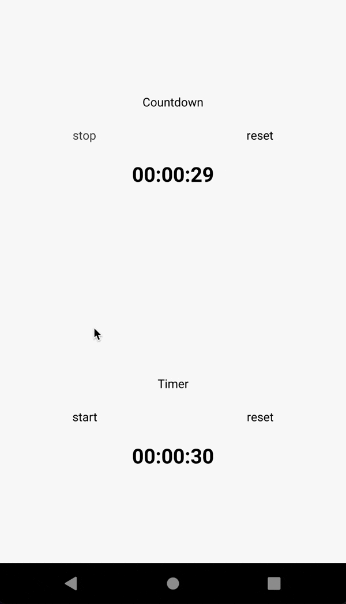

# `react-native-timestamp-timer-hooks`

React Native Timestamp timer hooks (timer, countdown)


The timer works even when the app is in the background. (unless the app is removed from the background)


---


<div align="flex-start">
  
</div>

<br>


## Getting started

---

```bash
yarn add react-native-timestamp-timer-hooks

or

npm install react-native-timestamp-timer-hooks
```


## Import

---

```jsx
import { useTimer, useCountdown } from 'react-native-timestamp-timer-hooks';
```


## Usage

---

<br>

### Example

```jsx
import * as React from "react"
import { StyleSheet, Text, TouchableOpacity, View } from 'react-native';
import useTimer from '../hooks/useTimer';

const Timer = () => {
  const { counter, start, stop, reset, isStart } = useTimer({
    from: 30000,
    interval: 100,
    to: 40000,
  });

  return (
    <View>
      <View>
        <Text style={[styles.defaultText, { alignSelf: 'center' }]}>Timer</Text>
      </View>
      <View style={{ flexDirection: 'row', justifyContent: 'space-around' }}>
        <TouchableOpacity
          onPress={() => {
            if (isStart) stop();
            else start();
          }}
        >
          <Text style={styles.defaultText}>{isStart ? 'stop' : 'start'}</Text>
        </TouchableOpacity>
        <TouchableOpacity onPress={() => reset()}>
          <Text style={styles.defaultText}>reset</Text>
        </TouchableOpacity>
      </View>
      <View style={{ alignItems: 'center', marginTop: 20 }}>
        <Text
          style={[styles.defaultText, { fontSize: 24, fontWeight: 'bold' }]}
        >
          {counter}
        </Text>
      </View>
    </View>
  );
};

export default Timer;

```

Check out the [example project](example) for more examples.

<br>

## Parameters
---
The `useTimer`, `userCountdown`  hooks have the following parameters:

<br>

| Name | Type | Description | Required | Default Value
| --- | --- | ---- | :---: | --- |
| `from` (ms) | number | The initial value of counter | ✅ | 0
| `to` (ms) | number | When the timer should stop | ❌ | undefined
| `interval` (ms) | number | When the timer should stop | ❌ | 50


<br>
<br>

## Return values
---
The `useTimer`, `userCountdown` hooks have the following returns values:


| Name | Type | Description
| --- | --- | --- |
| `counter` (ms) | number | The value of counter
| `start` | () => void | Start the counter
| `stop` | () => void | Stop the counter
| `reset` | (resetFrom? : number) => void | Reset the counter. There is an optional parameter to set the `resetFrom` value
| `isStart` | boolean | Return `true` if the counter is running, `false` if not


<br>
<br>


## License

The library is released under the MIT licence. 

For more information see LICENSE.
